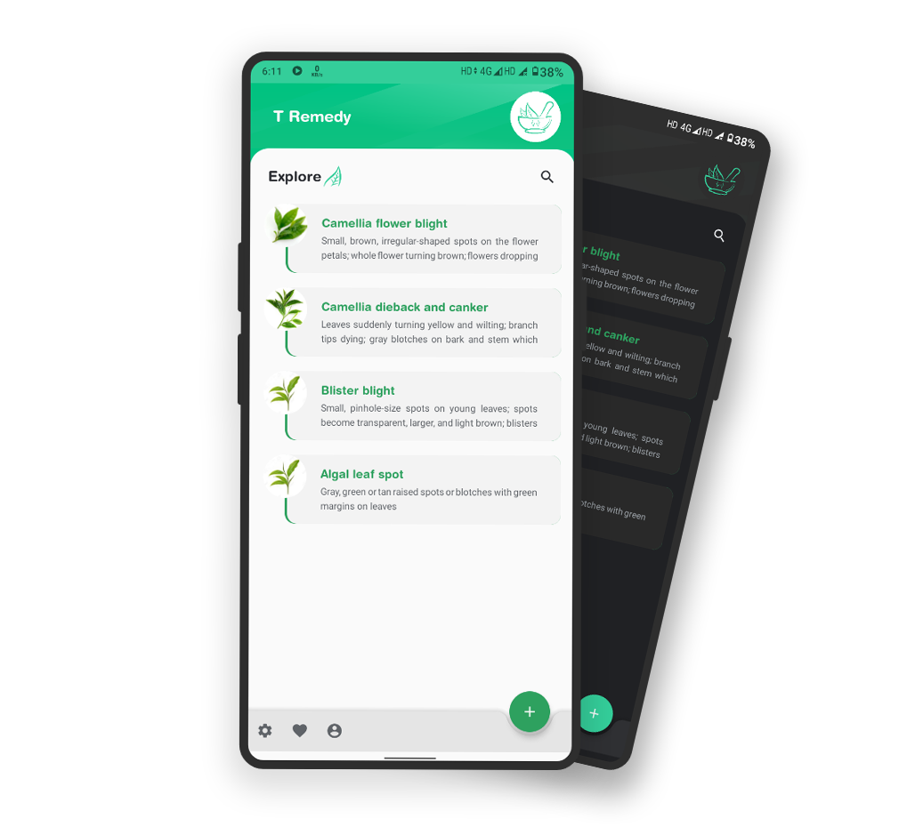
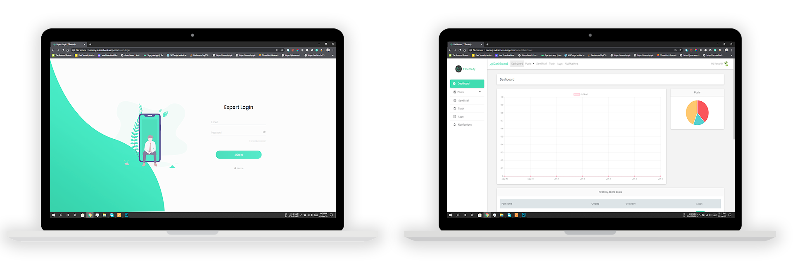

# T Remedy

    

**T Remedy** is an android based application developed for tea growers. This application gives a platform where they can easily find out the solution of various diseases related to tea husbandry and their management. This application is being maintained by a community of Assam Agriculture University.

As technology is being advanced the people are adapting the changes accordingly. The advancement of technology also brought a new way of farming. The biggest challenge for tea growers nowadays, is to produce tea without pesticide residues. The climatic conditions of the tea growing regions of India are conducive for a large number of insects and pests and diseases that needed to be managed. This project deals with the ways of protecting crops from diseases.

This project entitled T Remedy is an implementation of the above description. Farmers have knowledge of an android phone, they can directly register in the application and asked any questions related to tea diseases and also be able to upload the images of the symptoms. The application is design in such a way that all the posts are easily accessible to the users. The application provides a simple user interface that is easily understandable by anyone. It will encourage tea growers to work with technology for better results.

Here we also designed a web-based management system for admin so that they can easily maintain the application through the web. For adding flexibility to the system we designed an Application Programming Interface (API) which sharing the common database as that of the admin panel. The application uses this API to connect to the database. So that whenever any data is updated by admin the changes are reflected to the app automatically.

## Motivation

To design an Android based system to provide a platform to the tea-growing community to ask and get assistance from experts community on various tea farming related issues and to design a website that will handle the administration and expert’s side of the system, providing assistance to the farmers as well as the features for the administration of the whole system.

## Objectives

-   To receive the issues faced by farmers and try to fix them with the help of Experts of the domain.
-   To refine and validate a smart farming sensing system so that it meets the primary objective of the user’s requirements.
-   The system will encourage tea growers to work with technology.
-   The system gives a platform to the farmers to collect information by sitting at home.
-   To provide scientifically proven disease management techniques to the farmers.

## Features

- Password Hashing
- Authentication (using JWT)
- Role-Based Authorization
- Endpoint security
- Secure password recovery

# Implementation

Some features and screenshots of the implementated mobile application is described below:

-   ## LogIn / SignUp page

    The application provides one tap login that means OAuth login with Google.

       

      

          
      

-   ## Home Page of the Application

       

      

          
      

-   ## Favourite Page   

    When a user liked some posts, he/she can mark the post as favourite so that it can be accessed in offline mode.   

       

      

          
      

    
     

-   ## Admin Log in

       

      

          
      

-   ## Expert Log in

       

      
 
          
      

## Collaborator

[Kaushik Bordoloi](https://github.com/KaushikBordoloi)

[Mintu Moni Kurmi](https://github.com/mintukurmi)
